# Caesar Cipher

## Theory

Caesar Cipher is a type of substitution cipher
in which each letter in the plaintext is replaced by a letter some fixed number of positions down the
alphabetical order. Caesar cipher can be considered as a special case of monoalphabetic cipher. More information
available [here](https://en.wikipedia.org/wiki/Caesar_cipher).

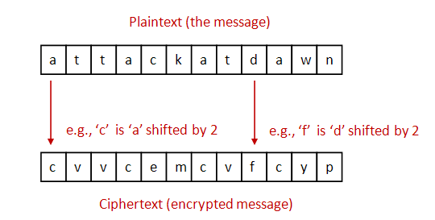

## Usage

> python3 caesar_cipher_encryption.py

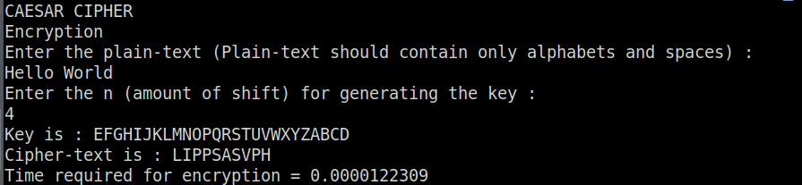

> python3 caesar_cipher_decryption.py

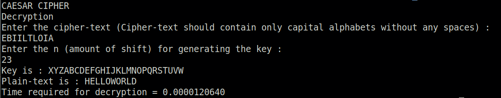

---

# Monoalphabetic Cipher

## Theory

A monoalphabetic cipher is a substitution cipher in which the letters of the plaintext are mapped to
ciphertext letters based on a single alphabetic key. It is done by replacing the letters in plaintext
with the letters of ciphertext according to the key provided.
More information available [here](https://en.wikipedia.org/wiki/Substitution_cipher)

## Usage

> python3 monoalphabetic_cipher_encryption.py

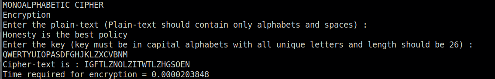

> python3 monoalphabetic_cipher_decryption.py

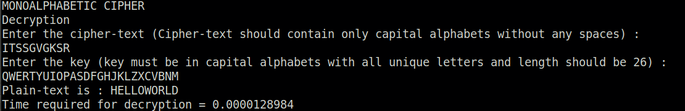

---

# Simplified DES

## Theory

Data Encryption Standard (DES) is a symmetric-key algorithm for the encryption of digital data.
DES is a block cipher - an algorithm that takes a fixed-length string of plaintext bits and transforms it through a series of complicated operations into another ciphertext bitstring of the same length.
Simplified DES (SDES) was designed for educational purposes only, to help students learn the structure of DES using smaller blocks and keys.

Properties :
-   It is a [Feistel block cipher](https://en.wikipedia.org/wiki/Feistel_cipher)
-   Plaintext : 8 bit
-   Key : 10 bit
-   Ciphertext : 8 bit

More information [here](https://en.wikipedia.org/wiki/Data_Encryption_Standard#Simplified_DES)

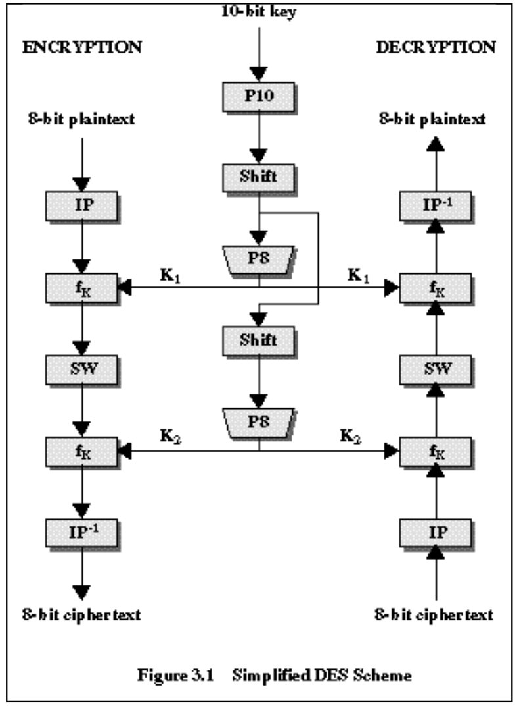

## Usage

The program *main.py* which is a driving program (to take input from user, call required functions and output the results) can be run to test the working of SDES.

>   python3 main.py

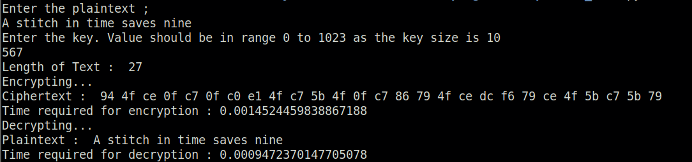

Also, the class `SDES` can be used in your program as follows.

Encryption :

```python
from SDES import SDES

plaintext = "Hello World"
key = 167
# Generate subkeys from the key
subkeys = SDES.generate_subkeys(key)
# Encrypt the plaintext using the subkeys
ciphertext = SDES.encrypt(plaintext, subkeys)
ciphertext = "".join(ciphertext)
print(ciphertext)   # 1101001011000....110111101
```

Decryption :

```python
from SDES import SDES

ciphertext = "1101001011000....110111101"
key = 167
# Generate subkeys from the key
subkeys = SDES.generate_subkeys(key)
# Reverse the subkeys for decryption
subkeys.reverse()
# Decrypt the ciphertext using the subkeys
plaintext = SDES.decrypt(ciphertext, subkeys)
plaintext = "".join(plaintext)
print(plaintext)   # Hello World
```

---

# Simplified AES

## Theory

Advanced Encryption Standard (AES) is a symmetric key, block cipher algorithm used for encrypting digital data.
Simplified AES (SAES) was designed for educational purposes only, to help students learn the structure of AES using smaller blocks and keys.

Properties :
-   It is a non-feistel block cipher
-   It is based on *substitution-permutation network*
-   Plaintext : 16 bit
-   Key : 16 bit
-   Ciphertext : 16 bit

SAES structure :

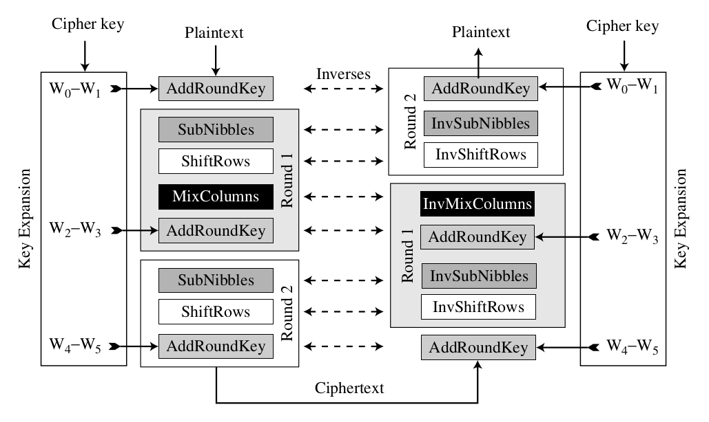

Subkeys generation :

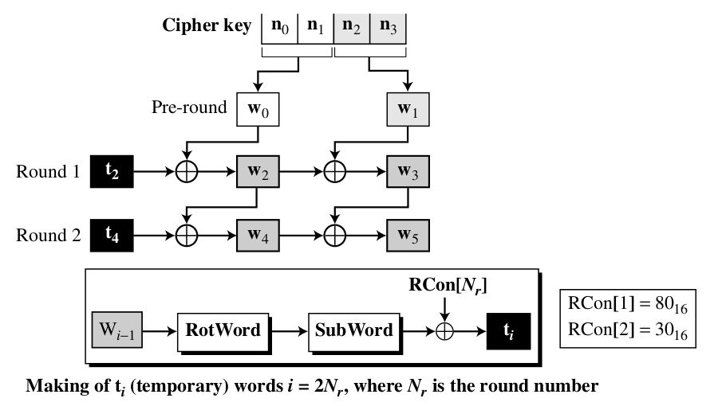

## Usage

The program *main.py* which is a driving program (to take input from user, call required functions and output the results) can be run to test the working of SAES.

>   python3 main.py

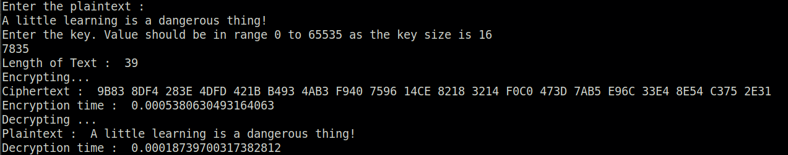

Also, the class `SAES` can be used in your program as follows.

Encryption :

```python
from SAES import SAES

plaintext = "Hello World!"
key = 15476
# Generate subkeys from the key
subkeys = SAES.generate_subkeys(key)
# Encrypt the plaintext using the subkeys
ciphertext_blocks = SAES.encrypt(plaintext, subkeys)
# Get in hexadecimal format
ciphertext_hex = []
for i in ciphertext_blocks :
    ciphertext_hex.append("{:04X}".format(int(i, 2)))

print(ciphertext_hex)   # ['2670', '78F3', '37A9', '138C', '296F', '0A9C']
```

Decryption :

```python
from SAES import SAES

ciphertext_hex = ['2670', '78F3', '37A9', '138C', '296F', '0A9C']
key = 15476
# Generate subkeys from the key
subkeys = SAES.generate_subkeys(key)
# Reverse the key pairwise
subkeys[0], subkeys[4] = subkeys[4], subkeys[0]
subkeys[1], subkeys[5] = subkeys[5], subkeys[1]
# Decrypt the ciphertext using the subkeys
plaintext_blocks = SAES.decrypt(ciphertext_hex, subkeys)
# Get the printable form of the decrypted plaintext
plaintext = []
for i in plaintext_blocks :
    plaintext.append(chr(int(i[:8], 2)))
    plaintext.append(chr(int(i[8:], 2)))

plaintext = "".join(plaintext)
print(plaintext)    # Hello World!
```

---

# RSA

## Theory

RSA (Rivest-Shamir-Adleman) is a public-key cryptosystem in which the 
encryption key is public and the decryption key is secret (private). An RSA user creates and publishes a public key based on two large prime numbers, along with an auxiliary value.
The prime numbers are kept secret. Messages can be encrypted by anyone, via the public key, but can only be decoded by someone who knows the prime numbers. It is used for secure data transmission. More information available [here](https://en.wikipedia.org/wiki/RSA_(cryptosystem))

This repo demonstrates a simple implementation of RSA for educational purpose only.

## Usage

The program *main.py* which is a driving program (to take input from user, call required functions and output the results) can be run to test the working of RSA.

>   python3 main.py

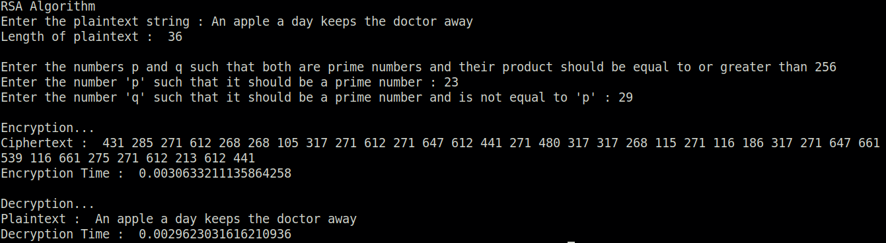

Also, the class `RSA` can be used in your program as follows.

Encryption :

```python
from RSA import RSA

plaintext = "Hello World"
p, q = 23, 17

# Perform encryption by passing required parameters
ciphertext = RSA.rsa_encryption(plaintext, p, q)
print(ciphertext)   # [353, 271, 105, 105, 155, 110, 9, 155, 367, 105, 348]
```

Decryption :

```python
from RSA import RSA

ciphertext = [353, 271, 105, 105, 155, 110, 9, 155, 367, 105, 348]
p, q = 23, 17

# Perform decryption by passing required parameters
plaintext = RSA.rsa_decryption(ciphertext, p, q)
plaintext = "".join(plaintext)
print(plaintext)   # Hello World
```

---

## References

-   Refer the documents under `docs` folder for more information and examples.